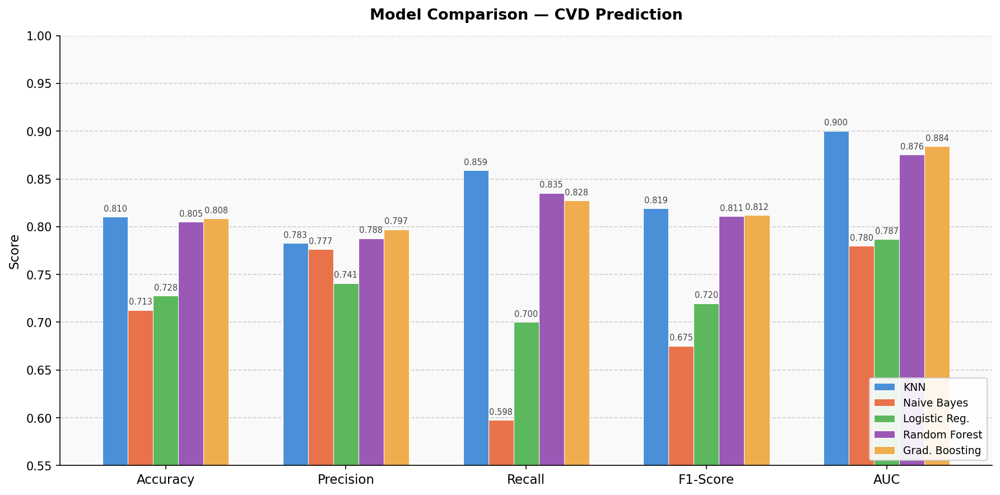

# Cardiovascular Disease (CVD) Prediction

This repository contains a comparative analysis of Machine Learning techniques for predicting Cardiovascular Diseases (CVDs). The project evaluates five classifiers trained on clinical and physical data, aiming to provide an accurate early-warning mechanism for patient risk assessment.

The project was developed as an undergraduate thesis in Electrical Engineering at the University of São Paulo (USP), in collaboration with mentors from LexisNexis Risk Solutions. It won the 2023 HPCC Systems Poster Competition in both the Data Analytics and Community Choice categories.

[View the research poster](poster.pdf)

---

## Table of Contents

- [About the Dataset](#about-the-dataset)
- [Project Architecture](#project-architecture)
- [Implementation: Python Pipeline](#implementation-python-pipeline)
- [Implementation: ECL on HPCC Systems](#implementation-ecl-on-hpcc-systems)
- [Baseline Results](#baseline-results)
- [Key Findings](#key-findings)
- [How to Run](#how-to-run)
- [Visualizations](#visualizations)

---

## About the Dataset

The project uses a publicly available medical dataset comprising 70,000 patient records and 11 features, grouped into three categories:

| Category | Features |
|---|---|
| Objective | `age` (days), `height` (cm), `weight` (kg), `gender` |
| Examination | `ap_hi` (systolic BP), `ap_lo` (diastolic BP), `cholesterol`, `gluc` |
| Subjective | `smoke`, `alco`, `active` |

Target variable: `cardio` — presence (1) or absence (0) of cardiovascular disease.

---

## Project Architecture

The pipeline is divided into two strictly isolated stages to prevent data leakage:

```
cardio_raw.csv
      │
      ▼
┌─────────────────────┐
│  preprocess_data.py │  -> outlier removal (Z-Score, training set only)
│                     │  -> class balancing (upsampling minority class)
│                     │  -> train/test split (80/20)
└─────────────────────┘
      │
      ▼
┌─────────────────────┐
│   cvd_research.py   │  -> ColumnTransformer (StandardScaler + OneHotEncoder)
│                     │  -> training 5 optimized classifiers
│                     │  -> performance report + visualizations
└─────────────────────┘
```

The strict separation ensures that scaling and encoding are fit only on training data, a common source of data leakage in ML pipelines.

---

## Implementation: Python Pipeline

The Python implementation (`src_python/`) is the full research pipeline developed for the thesis. It includes:

- Extensive preprocessing: outlier removal using Z-Score thresholds, class balancing via upsampling, train/test split, and careful feature engineering (e.g. age converted from days to years).
- ColumnTransformer: `StandardScaler` for numerical features, `OneHotEncoder` for categorical features, applied after splitting to avoid leakage.
- Five classifiers: K-Nearest Neighbors, Gradient Boosting, Random Forest, Logistic Regression, and Naive Bayes, each with hyperparameter tuning.
- Full evaluation: accuracy, precision, recall, F1-score, AUC, confusion matrices, and calibration curves per model.

---

## Implementation: ECL on HPCC Systems

The ECL implementation (`src_ecl/`) is a prototype built using HPCC Systems, an open-source distributed computing platform designed for massive-scale data processing.

ECL (Enterprise Control Language) is HPCC's native data-centric language. The key insight of this implementation is that ML inference on clinical data can be parallelized across a distributed cluster, enabling the pipeline to scale to billions of records, far beyond what a single-node Python script can handle.

This prototype implements two models:

- Logistic Regression: using the HPCC `ML_Core` bundle's `Binomial` module, with feature selection via a Pearson correlation matrix that reduced the model to 6 most-relevant features without accuracy loss.
- Random Forest: using the `LearningTrees` bundle's `Classification Forest` module, with categorical fields passed as nominal hyperparameters for improved performance.

The ECL implementation is intentionally simpler than the Python pipeline. Its purpose is to demonstrate that the same predictive approach can be deployed at distributed scale, not to replicate every preprocessing step.

---

## Baseline Results

Results from the Python pipeline:

| Classifier | Accuracy | Precision | Recall | F1-Score | AUC |
|---|---|---|---|---|---|
| K-Nearest Neighbors | 0.8104 | 0.7829 | 0.8589 | 0.8192 | 0.9003 |
| Gradient Boosting | 0.8085 | 0.7971 | 0.8275 | 0.8120 | 0.8841 |
| Random Forest | 0.8052 | 0.7878 | 0.8354 | 0.8109 | 0.8755 |
| Logistic Regression | 0.7276 | 0.7409 | 0.7000 | 0.7199 | 0.7869 |
| Naive Bayes | 0.7128 | 0.7766 | 0.5975 | 0.6754 | 0.7798 |

---

## Key Findings

KNN achieved the highest overall performance with an AUC of 0.9003, followed closely by Gradient Boosting and Random Forest. The three tree-based and distance-based models clustered tightly in accuracy (~0.805-0.810), suggesting the dataset's decision boundary benefits from non-linear classifiers.

Recall is the critical metric in this domain. A false negative (missing a patient at risk) is clinically more costly than a false positive. KNN's recall of 0.8589 is the strongest among all models, making it the recommended choice despite marginally lower precision than Gradient Boosting.

Logistic Regression underperforms non-linear models but remains interpretable. Its reduced 6-feature version (selected via Pearson correlation) achieved comparable accuracy to the full 11-feature model, confirming that `ap_hi`, `ap_lo`, `cholesterol`, `gluc`, `weight`, and `age` carry most of the predictive signal.

Data preparation was the single most impactful step. Both the Python and ECL pipelines showed that careful outlier removal and class balancing consistently improved model metrics across the board.

---

## How to Run

**1. Clone the repository and set up the environment:**

```bash
git clone https://github.com/fulviofavilla/cvd-prediction-ml.git
cd cvd-prediction-ml
python -m venv venv
source venv/bin/activate  # On Windows: venv\Scripts\activate
pip install -r requirements.txt
```

**2. Run the preprocessing pipeline:**

Reads `data/cardio_raw.csv` and generates the clean train/test split.

```bash
python src_python/preprocess_data.py
```

**3. Run the model evaluation:**

Trains all five classifiers and outputs the performance report and visualizations.

```bash
python src_python/cvd_research.py
```

---

## Visualizations

Running `cvd_research.py` generates a grouped bar chart comparing all five classifiers across Accuracy, Precision, Recall, F1-Score, and AUC, saved to `outputs/model_comparison.png`.



---

## Dataset Source

[Cardiovascular Disease Dataset - Kaggle (Sulianova)](https://www.kaggle.com/sulianova/cardiovascular-disease-dataset)

---

## License

MIT